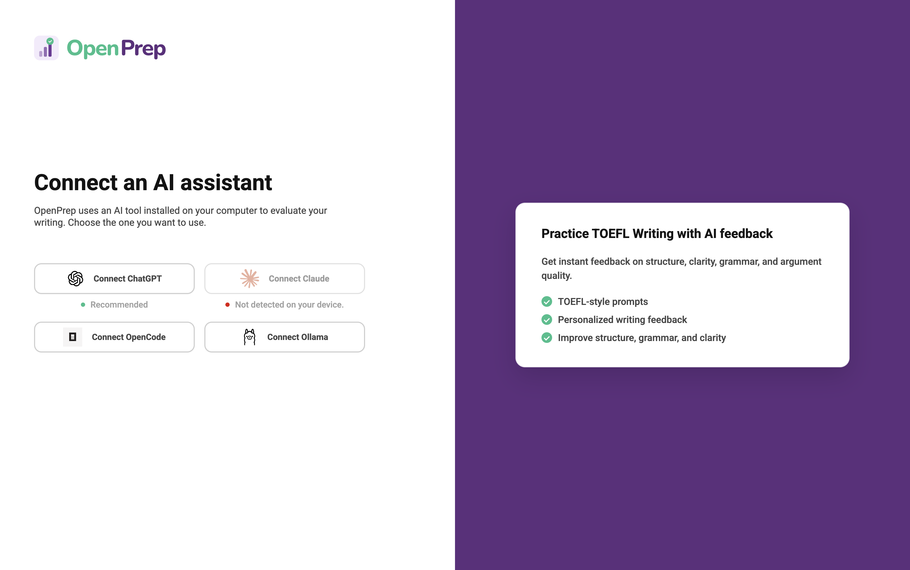

<p align="center">
  
</p>

# switchboard-ai-sdk

`switchboard-ai-sdk` is a TypeScript SDK for Node.js and Electron apps that lets developers discover and use local AI tools already installed on a user's machine, including Codex, Claude Code, OpenCode, and Ollama, through one consistent API.

This is the main project overview and getting-started guide. For response shapes, endpoint payloads, and provider-specific API behavior, see [docs/API-REFERENCE.md](docs/API-REFERENCE.md). For apps that want to call the SDK directly without exposing HTTP, see [docs/SDK-USAGE.md](docs/SDK-USAGE.md).

The published npm package name is `switchboard-ai-sdk`.

It discovers and connects to local AI tools like:

- Ollama
- Codex
- Claude Code
- OpenCode

It is especially useful for developers who want to avoid paying for hosted LLM APIs and instead use local tools they or their users already have, like Codex, Claude Code, OpenCode, or Ollama, through one consistent API.

If you use OpenCode and do not have, or do not want to provide, a paid AI subscription, you can point it at OpenCode's free hosted models.

The goal is simple: use local AI tools through an interface that feels like a traditional LLM provider API.

### How this works in practice

Give users the freedom to select the AI tool they want, or steer them toward your recommendation. ```switchboard-ai-sdk``` supports the full flow end to end.



## Install

```bash
npm install switchboard-ai-sdk
```

## Quick Start

If your app runs in Node.js or Electron and does not need HTTP endpoints, start with the direct SDK flow below. If you need a local HTTP bridge for another process, skip to [Run the Local HTTP Server](#run-the-local-http-server).

Discover the tools that are available on the current machine, pick one, connect, and send a prompt:

```ts
import { connect, discover } from "switchboard-ai-sdk";

const tools = await discover();
const toolId = tools.find((tool) => tool.available)?.id;

if (!toolId) {
  throw new Error("No local AI tool is available.");
}

const tool = await connect(toolId);
```

```ts
const response = await tool.chat({
  messages: [
    {
      role: "user",
      content: "Generate me a list of five healthy lunch ideas."
    }
  ]
});

console.log(response?.message.content);
```

This keeps the app flow simple: pass a prompt, get a response.

## Without The Server

Direct SDK usage is the default choice when your app can call local tools in-process:

- Electron main process integrations
- desktop apps with direct Node.js access
- local scripts and CLIs
- apps that want typed exceptions instead of HTTP responses

Example:

```ts
import { connect } from "switchboard-ai-sdk";

const tool = await connect("ollama");

const result = await tool.chat(
  {
    messages: [
      {
        role: "user",
        content: "Summarize the main idea in one paragraph."
      }
    ]
  },
  {
    timeoutMs: 30000
  }
);

console.log(result.message.content);
```

## Retry-Aware Fallback

Use `chat()` when you want a static provider order with immediate fallback on unavailable tools and retry-aware failover for execution issues like timeouts.

```ts
import { chat } from "switchboard-ai-sdk";

const response = await chat(
  {
    messages: [{ role: "user", content: "Summarize this repo." }]
  },
  {
    providers: ["codex", "claude-code", "opencode", "ollama"],
    retries: 1,
    perAttemptTimeoutMs: 15000
  }
);

console.log(response.toolId);
console.log(response.result.message.content);
console.log(response.attempts);
```

## Provider Config

Call `configure()` before `connect()` or before starting the HTTP server when you want to overwrite global defaults for the current process. In most apps, you call it once during startup and reuse that config until you need to change it.

You can set provider-specific values once instead of passing them on every call:

```ts
import { configure, connect, discover } from "switchboard-ai-sdk";

configure({
  ollamaHost: "http://192.168.1.20:11434",
  ollamaModel: "qwen3:14b",
  codexModel: "gpt-5.5",
  codexSandbox: "workspace-write",
  claudeCodeModel: "claude-sonnet-4",
  claudeCodeMaxTurns: 4,
  opencodeModel: "openai/gpt-5.5"
});

const tools = await discover();
const tool = await connect("codex");
```

All subsequent SDK and server calls in the current process use that config until you call `configure()` again.

See [docs/SDK-USAGE.md](docs/SDK-USAGE.md) for more details.

## Discover Models

When a provider can expose models, `discover()` returns them:

```ts
import { discover } from "switchboard-ai-sdk";

const tools = await discover();

for (const tool of tools) {
  console.log({
    id: tool.id,
    available: tool.available,
    models: tool.models ?? [],
    defaultModel: tool.defaultModel ?? null
  });
}
```

Current behavior:

- Ollama and OpenCode  return all available models.
- Codex and Claude Code return configured models when one is explicitly set.

OpenCode's model lineup changes frequently, so this README does not try to mirror it. Check the official OpenCode model docs for the current provider and model format: <https://opencode.ai/docs/models/>.

For OpenCode Go subscriptions: <https://opencode.ai/docs/go/>

Opencode also offers free and strong models like DeepSeek V4 Flash that you can use.

## Run the Local HTTP Server

Use the HTTP server when the caller is not a Node.js process, or when you want a process or network boundary instead of calling the SDK directly in-process.

You can expose discovery and chat over HTTP:

```ts
import { startSwitchboardServer } from "switchboard-ai-sdk";

const server = await startSwitchboardServer({
  port: 3000
});

console.log(server.url);
```

Endpoints:

| Method | Path | Endpoint |
|---|---|---|
| GET | `/config` | Read the current process-level provider config |
| PUT | `/config` | Replace the current process-level provider config |
| GET | `/health` | See health and auth status of all AI tools |
| GET | `/discover` | Discover available AI tools |
| POST | `/auth/:toolId` | Start authentication process for specific AI tool   |
| POST | `/chat` | Route across providers with retries and fallback |
| POST | `/chat/:toolId` | Send prompt to specific AI tool |
| GET | `/health/:toolId` | Get health status of specific AI tool |


```bash
curl http://127.0.0.1:3000/discover
```

Example response:

```json
{
  "tools": [
    {
      "id": "codex",
      "name": "Codex",
      "type": "agent",
      "available": true,
      "version": "1.2.3",
      "capabilities": ["agent-task", "health-check"],
      "models": ["gpt-5-codex"],
      "defaultModel": "gpt-5-codex"
    },
    {
      "id": "ollama",
      "name": "Ollama",
      "type": "runtime",
      "available": true,
      "version": "0.8.0",
      "capabilities": ["chat", "health-check"],
      "models": ["qwen3:14b"],
      "defaultModel": "qwen3:14b"
    }
  ]
}
```

You can also configure provider defaults once over HTTP instead of repeating them on every request:

```bash
curl -X PUT http://127.0.0.1:3000/config \
  -H "content-type: application/json" \
  -d '{"codexModel":"gpt-5.5","codexSandbox":"workspace-write"}'
```

The HTTP API now mirrors the full discovery payload and process-level config behavior. If you are already in Node.js or Electron, prefer the direct SDK when you want in-process objects and typed exceptions. Use the server when HTTP responses and JSON error payloads are a better fit for the caller.

## Environment Variables

Useful configuration knobs include:

- `OLLAMA_HOST`
- `SWITCHBOARD_OLLAMA_MODEL`
- `SWITCHBOARD_CODEX_MODEL`
- `SWITCHBOARD_CODEX_SANDBOX`
- `SWITCHBOARD_CLAUDE_CODE_MODEL`
- `SWITCHBOARD_CLAUDE_CODE_MAX_TURNS`
- `SWITCHBOARD_OPENCODE_MODEL`

These are optional defaults. Values passed through `configure()` take precedence until changed.

Example:

```bash
SWITCHBOARD_OPENCODE_MODEL=opencode/deepseek-v4-flash-free
```

Other valid examples:

```bash
SWITCHBOARD_OPENCODE_MODEL=opencode-go/kimi-k2.7-code
SWITCHBOARD_OPENCODE_MODEL=openai/gpt-5.5
```

## Documentation

- [Docs site](https://mauriceheinze.github.io/switchboard-ai-sdk/)
- [Getting Started](https://mauriceheinze.github.io/switchboard-ai-sdk/guide/getting-started)
- [API Reference](https://mauriceheinze.github.io/switchboard-ai-sdk/api/reference)
- [Examples](https://mauriceheinze.github.io/switchboard-ai-sdk/examples)
- [Compare with alternatives](https://mauriceheinze.github.io/switchboard-ai-sdk/compare)
- [For AI Agents](https://mauriceheinze.github.io/switchboard-ai-sdk/for-ai-agents)
- [llms.txt](https://mauriceheinze.github.io/switchboard-ai-sdk/llms.txt)

## License

MIT. See [LICENSE](LICENSE).
